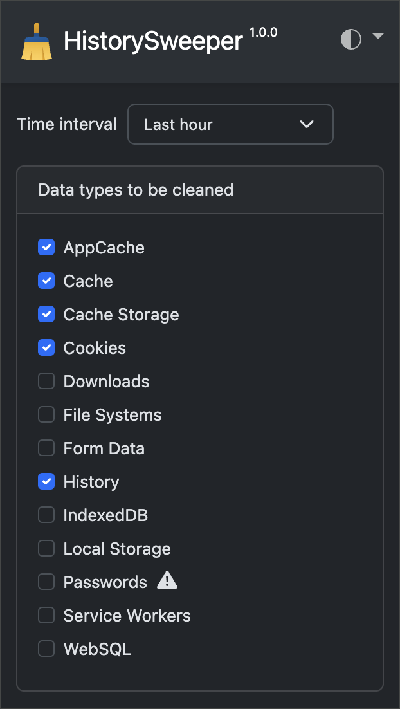
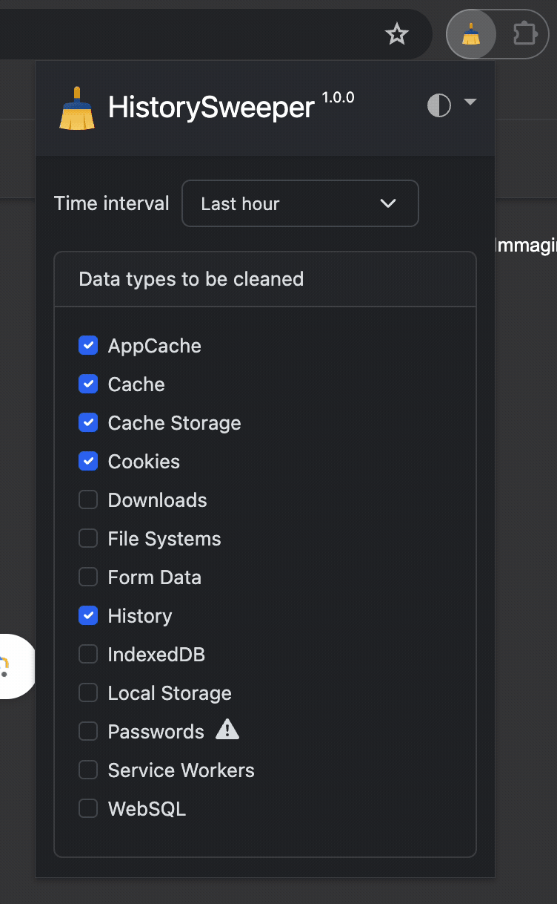

# HistorySweeper

HistorySweeper is a Google Chrome extension designed to enhance your online privacy by automatically cleaning your browsing history each time you start your browser. With customizable options, you can choose exactly what data to clear - including cookies, cached files, and downloads history. Whether you're looking to free up some disk space, keep your browsing private, or both, HistorySweeper provides a simple and efficient solution. It's easy to use and requires minimal setup, making it a handy tool for any Chrome user concerned about their privacy.

## Features

- **Automatic History Cleaning**: HistorySweeper automatically clears your browsing history each time you start your browser, ensuring that your browsing sessions start with a clean slate.
- **Customizable Cleaning Options**: Choose exactly what data you want to clear. Options include cookies, cached files, downloads history, form data, and more.
- **Privacy Protection**: By regularly clearing your browsing data, HistorySweeper helps protect your privacy and keep your browsing private.

## Installation

1. Download or clone this repository to your local machine.
2. Open Google Chrome and navigate to `chrome://extensions`.
3. Enable "Developer mode" at the top-right.
4. Click the "Load unpacked" button that just appeared.
5. Select the directory where you saved this repository.

## Usage

Using the HistorySweeper extension is simple and straightforward. Here's how you can get started:

1. **Open the Extension**: Click on the HistorySweeper icon in your browser's toolbar to open the main interface.

    

2. **Customize Your Settings**: In the main interface, use the checkboxes to select the data types you want to clear. Use the dropdown menu to select your preferred theme.

    

That's it! HistorySweeper will now automatically clear your selected browsing data each time you start your browser, and the interface will appear in your chosen theme.

## License

This project is licensed under the MIT License. See the [LICENSE](LICENSE) file for details.
